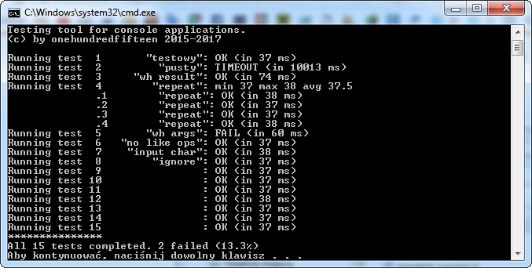

# autotest
Simple testing tool for console apps.

You can run your application and test it against given conditions:

* app's arguments
* output pattern
* input
* exit code
* execution time

You can also measure average execution time of your program.

All you need is to prepare a xml file with test scenarios.

Minimum Windows Vista is recommended.

